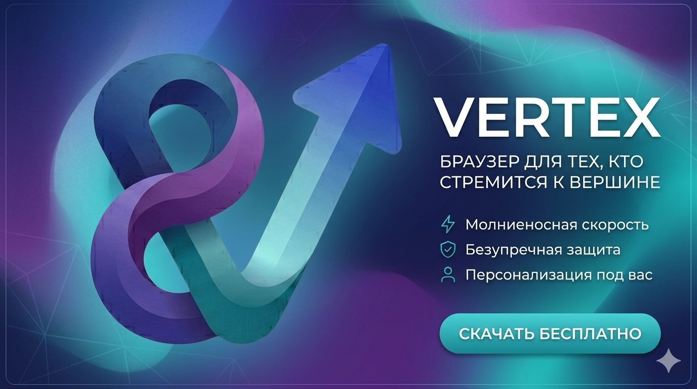

# 

<div align="center">
  <h1>Vertex Browser</h1>
  <p><i>A boutique, minimalist web experience built with Rust & Glassmorphism.</i></p>

  <p>
    
    
    
  </p>
</div>

---

## ✨ The Vision
**Vertex** is not just another browser; it's a statement. Designed for those who appreciate fine details, minimalist aesthetics, and performance. Built on the modern **Tauri v2** framework, Vertex offers a localized, secure, and highly customizable portal to the web.

## 🚀 Key Features

### 💎 Glassmorphism UI
A stunning, responsive interface with dynamic blur effects, premium color presets (Dusty Rose, Grape Sorbet, Phantom Mint), and a compact "boutique" toolbar that maximizes your content area.

### 🛡️ Native Ad-Blocker
High-performance, Rust-powered ad and tracker blocking integrated directly into the network layer. 

### 🧩 Vertex Extensions (User Scripts)
A powerful script engine that allows you to inject custom JavaScript and CSS into any website. Create your own tools or install community scripts with a single click.

### 🔒 Secure Vault
A built-in, local-first password manager with encryption, keeping your credentials safe and accessible only to you.

### 🎨 Total Customization
Change your accent colors, blur intensity, and UI scaling in real-time. Vertex adapts to your style, not the other way around.

---

## 🛠️ Technical Stack
- **Backend:** [Rust](https://www.rust-lang.org/) & [Tauri v2](https://v2.tauri.app/)
- **Frontend:** HTML5, Vanilla JavaScript, Premium CSS3
- **Storage:** Local encrypted vault & JSON-based configuration

## 📦 Getting Started

### Prerequisites
- [Rust](https://rustup.rs/)
- [Node.js](https://nodejs.org/)
- [Tauri CLI](https://v2.tauri.app/start/prerequisites/)

### Setup & Development
1. Clone the repository:
   ```bash
   git clone https://github.com/Vertex-studio-ak/first-Vertex-.git
   cd first-Vertex-
   ```
2. Install dependencies:
   ```bash
   npm install
   ```
3. Run in development mode:
   ```bash
   npm run tauri dev
   ```
4. Build for production:
   ```bash
   npm run tauri build
   ```

---

<div align="center">
  <p>Crafted with ❤️ by Vertex Studio</p>
</div>
